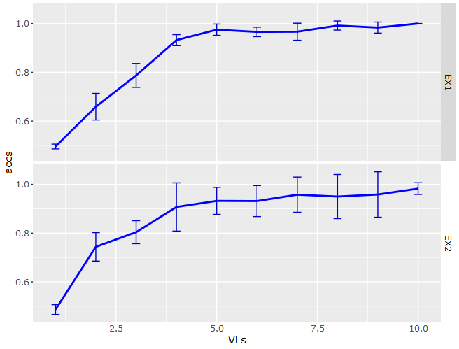
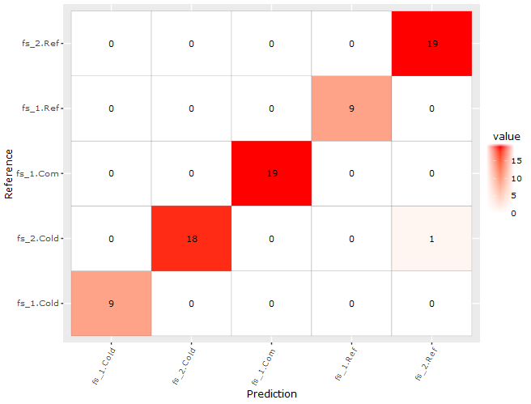
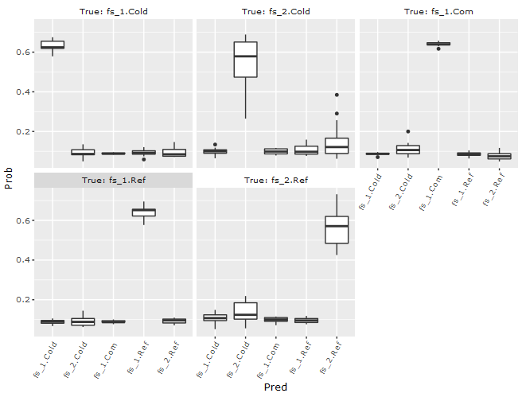
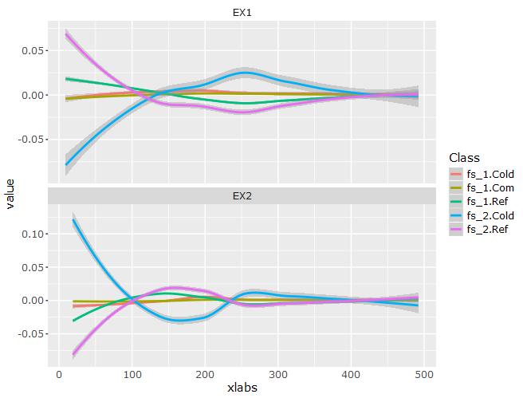
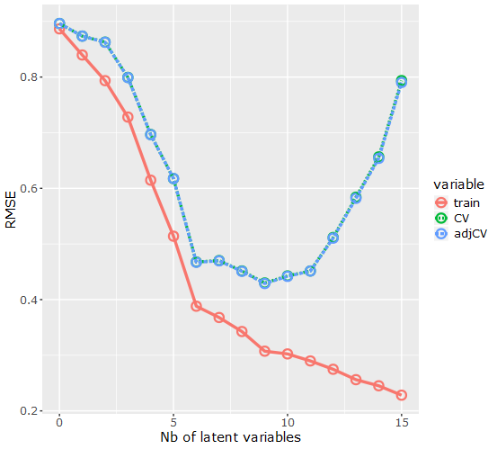
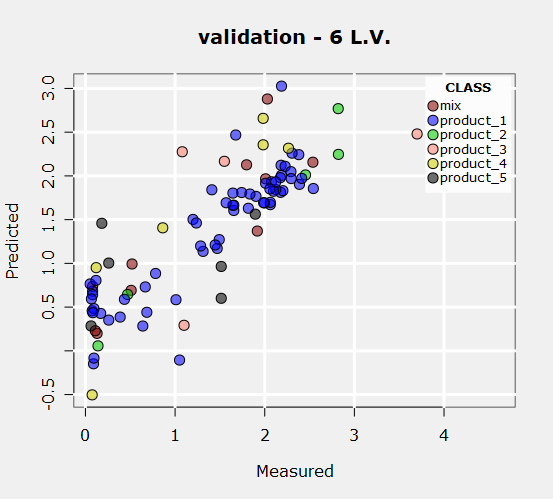
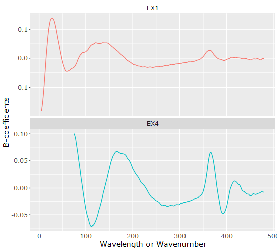
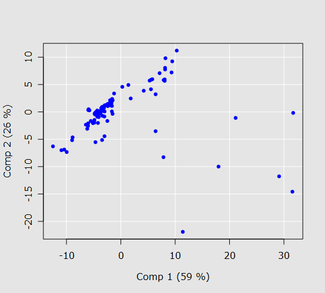
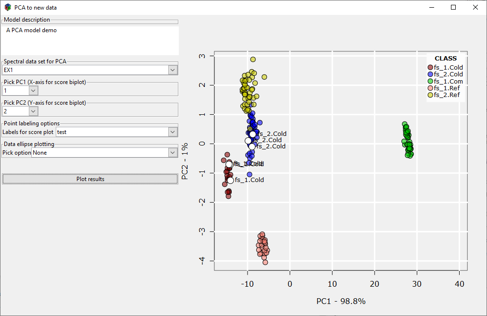

<!-- 
rmarkdown::html_vignette: 
      df_print: paged
      fig_caption: yes
      toc: TRUE
    pagedown::html_paged:
      df_print: paged
      fig_caption: yes
      toc: TRUE
   -->

```{r setup, include = FALSE}
knitr::opts_chunk$set(
  collapse = TRUE,
  warning = FALSE,
  comment = "#>"
)
```


<style type="text/css">

h1.title {
  font-size: 38px;
  color: DarkBlue;
  text-align: center;
}
h3.subtitle {
  font-size: 30px;
  color: DarkBlue;
  text-align: center;
}
h4.author { /* Header 4 - and the author and data headers use this too  */
    font-size: 24px;
  font-family: "Times New Roman", Times, serif;
  color: DarkBlue;
  text-align: center;
}
h4.date { /* Header 4 - and the author and data headers use this too  */
  font-size: 18px;
  font-family: "Times New Roman", Times, serif;
  color: DarkBlue;
  text-align: center;
}
</style>

<!-- First is for figure captions, second for tables-->
<style>
p.caption {
  font-size: 16px;
  margin-top: 10px;  
  text-align: center;
}
caption {  
   text-align: left;
   font-size: 16px;
   margin-bottom: 10px; 
   color: "black";
    }
</style>

<br><br>

```{r out.width="100%", echo=FALSE}

```

<br><br>   
     
# Introduction  

The *InSpectraR* package bundles the *InSpectoR* script and associated functions together with some data used in the help pages for the package and this vignette. *InSpectoR* creates a GUI (Figure \@ref(fig:fig1-1)) for working with spectral data. This project started from the need to easily view spectra for quality control before performing further processing and develop chemometrics models. One of the unique feature of this tool is its ability to work on spectra from a diversity of sources (*e.g.* fluorescence, Raman, transmittance...). Raw data can be visualised and tools are provided to select and organise the data for viewing and data set editing. Further developments of *InSpectoR* included tools for preprocessing spectral data on a per spectrum basis (*e.g.* filtering, scaling...). Principal component analysis can also be performed to further help in quality control. Finally partial least square regression for classification or prediction was implemented both in model development and application modes.

As can be seen on Figure \@ref(fig:fig1-1), the interface has a number of tabs ("Data selection", "Apply models",...). Each tab corresponds to a specific task. This vignette documents the functionalities implemented for each task. But first, the structure of the data will be explained.

<br><br>  

```{r fig1-1, echo=FALSE, fig.cap="The InSpectoR GUI", out.width="100%", fig.align="center"}
knitr::include_graphics("GUI_init_w_data.png")
```

[TOC](#TOC)

# Structure of the data set
All the data for a given data set should be contained in a single directory. All files are text files with a header, use a tab delimiter for columns and the "." as the decimal delimiter. A data set should have a *Y* file and a number of *X* files. After the header, each line in the files correspond to a sample. The key to link the content of the *Y* file to the spectra in the *X* files is their first column that should be identical (usually a unique sample identification code). The *Y* file can contain any data and descriptors for the samples. The *X* files contain spectral data. Each *X* file should contain only one type of spectra (*e.g.* fluorescence under excitation at a given wavelength). Therefore there are as many *X* files as spectrum types.

[TOC](#TOC)


## File naming convention
 
### *Y* data file
The *Y* data file name follows the following prototype:  
&nbsp;&nbsp; **Y_** ***somename***.*txt*

There are three components:  

1. **Y_** is mandatory.  

2. ***somename*** is anything.  

3. *txt* is a mandatory file extension.  

For example, *Y_Data1.txt* is a valid name.  

[TOC](#TOC)  

### *X* data files  
The *X* data file name follows the following prototype:  
&nbsp;&nbsp; &ast;_***somename*** &ast;.*txt*  

There are four components:  

1. the &ast; at the beginning is a place holder for a user defined name. This component is used  in *InSpectoR* as a tag for identifying the data type so use something meaningful. For example, we use *EX1* to identify fluorescence under excitation at wavelength #1. 

2. ***somename*** must be the same as ***somename*** in the accompanying *Y* file. 
This part of the name creates the link to the *Y* file.  

3. the &ast; before the file extension could be anything but should start with a letter.  

4. *txt* is a mandatory file extension.  

For example, *EX1_Data1_I.txt*, *Transmit_Data1.txt* and *Raman_Data1.txt* are three valid names for the *Y* file *Y_Data1.txt*.  

As an other example, the content of the *foodstuff_powder* directory installed with this package is:  

```{r, echo=FALSE}
dir("../inst/foodstuff_powder")
```  
It contains two *Y* data files and four *X* files corresponding to fluorescence spectra acquired under excitation at 4 different wavelengths for each of the *Y* data files.  

[TOC](#TOC)  

## File content  
### *Y* data file  
As a valid example, the top of the *Y* file in the *foodstuff_powder* directory of this package is:  
<br>
```{r tab2-1, echo=FALSE}
library(kableExtra)
dum=read.csv(file="..//inst/foodstuff_powder/Y_foodstuff.txt",header = TRUE, dec=".", sep="\t")
nc <- seq_len(ncol(dum))
knitr::kable(dum[1:4,], caption="Content of a valid *Y* file.", align = "c", booktabs=TRUE) %>% kableExtra::kable_styling(bootstrap_options=c("striped"), full_width = T, font_size = 12) %>% 
kableExtra::column_spec(nc,width="30em")
``` 


A valid *Y* file can have as many columns as needed and each column can contain numbers or characters. Columns containing characters will be treated as factors. The first column, here named *ECHID* is the a sample ID that is used to link data in the *Y* file to data in the *X* files. This first column must be exactly the same as the first column of the associated *X* files but the column name can be different. 

[TOC](#TOC)

### *X* data files

As a valid example, the top-left part of the *X* file named *EX1_foodstuff_I.txt* in the *foodstuff_powder* directory of this package is:  
<br>
```{r tab2-2, echo=FALSE}
dum=read.csv(file="..//inst/foodstuff_powder/EX1_foodstuff_I.txt",header = TRUE, dec=".", sep="\t")
colnames(dum)=c("EchID",as.character(seq(1,500,1)))
nc <- seq_len(8)
knitr::kable(dum[1:4,1:8], caption="Content of a valid *X* file.", digits=3, booktabs=TRUE) %>% 
kableExtra::kable_styling(bootstrap_options=c("striped"), full_width = T, font_size = 12)  %>% 
kableExtra::column_spec(nc,width="20em")
``` 


The first column is the same as for the associated *Y* file displayed in Table \@ref(tab:tab2-1). The header row for columns 2 and the following is the wavelength or the wavenumber (usually the x-axis when plotting spectra), here from 1 to 500 (only first 8 columns shown in Table \@ref(tab:tab2-2)). Each line, starting at column 2, contains the spectrum for the sample identified in the first column. For example, plotting the first spectrum from Table \@ref(tab:tab2-2)) can be achieved with the following lines of code.

```{r fig2-1, echo=TRUE, fig.cap="First spectrum in EX1_foodstuff_I.txt", out.width="66%", fig.align="center"}
dum=read.csv(file="..//inst/foodstuff_powder/EX1_foodstuff_I.txt",
             header = FALSE, dec=".", sep="\t")
plot(as.numeric(dum[1,-1]),as.numeric(dum[2,-1]),
     type="l",
     lwd=2, col = "blue",
     xlab="Wavelength [nm]",
     ylab="Fluorescence intensity [A.U.]",
     main=paste0("Sample ",dum[2,1]))
grid()
```

[TOC](#TOC)

# Using the *InSpectoR* GUI

When the *InSpectoR* script is invoked with no parameters, the GUI is displayed, your computer is set up for parallel processing (used with some functions from the *caret* package) and only the *Data selection* tab is visible. *InSpectoR* can be called with parameters to disable parallel computing, automatically load data and to specify the initial dimensions of the GUI. See the help page for *InSpectoR* for details.  

Tooltips pop up when hovering the mouse over the interface. Stay over an area and after about one second, a tooltip shows up. Tooltips were not implemented for all GUI components. Usually, tooltips are not implemented when the action(s) linked to a GUI component is obvious given the context. 

In the *Data selection* tab, a *Hints* frame serves as a reminder for the various interactions with the table in the *Y data* frame, the plotting area and the *Properties* frame.  

[TOC](#TOC)  


## *Data selection* tab

### Loading a data set

To load data, press the *OPEN a Y file* button. The *Y* file content is loaded in the *Y data* frame in the lower-left corner of the GUI. Then the associated *X* data files are identified and the content of the first column is compared to the content of the first column of the *Y* data file to verify that they are identical. If not, a warning message is displayed and the corresponding *X* file is ignored. Finally, the user is prompted to accept the creation of backup files if there are no backup files. Backup files are stored in subdirectories under the data set directory with names *BCK_Files_xx* where the *xx* is the backup number.  

Loading a new data set resets the whole environment as if the GUI had just been launched. All previously loaded data and processing options and results are discarded.  

In Figure \@ref(fig:fig1-1), the last two columns of the *Y data* table are labeled *NoSeq_File* and *NoSeq*. Initially, these two columns contain identical numbers. The first one gives the row number of the corresponding sample in the data set files. This is used internally by *InSpectoR* when there is a need to go back to the original data. As will be seen later in this document, the user can select a subset of data. The *NoSeq* column gives the sample position in the subset. This is useful when the user wants to reorder the data (see Section \@ref(visualising-spectra)).

After loading a data set, the GUI looks like in Figure \@ref(fig:fig1-1).


[TOC](#TOC)

### Selecting *X* data types
The frame labelled *Spectral data files - Select* in the top-left corner of the *Data selection* tab is where a user selects the data type to work with. More than one data type can be selected (*click* for a single data type, *ctrl-click* to add or remove from selection or *shift-click* to extend current selection). All selected data types are grouped together for subsequent operations. Therefore, modifying the data type selection will reset all pretreament operations and will delete all models developed. 

[TOC](#TOC)

### Visualising spectra  
Clicking on a row in the *Y data* table will display the corresponding spectrum (or spectra when more than one data type was selected). More than one line can be selected (*ctrl-click* to add or remove and *shift-click* to extend selection) to show spectra from multiple samples (*i.e.* rows in the *Y data* table).  

A user can also click one of the column headers in the *Y data* table. The *Y data* table will be sorted (clicking more than once will alternate between ascending and descending sorting). Further, when the selected column contains a factor, this will generate a plot of all samples aggregated with the *mean* function using the *aggregate* function from the *base* package. If the selected column contains numeric data, the user will be prompted for options for converting the numeric data to factor data. When prompted, the user can cancel to avoid conversion to factor data. In this case, the data will be sorted but the plot is not updated. 

Right-clicking in the plot area invokes a context menu for selecting the type of interaction with the plot. The first two (*Select sample(s)* and *Zoom*) define an interaction mode and the other ones launch immediate actions without changing the mode:  

*  Select sample(s):  
    + **clicking** on the plot area will select the closest spectrum. This selection will be reflected in the *Y data* table and spectra of all selected data types for the selected sample will be displayed.  
    + **Dragging a rectangle** over the plot area will select all samples enclosed in the rectangle. This selection will be reflected in the *Y data* table and spectra of all selected data types for the selected samples will be displayed.  
* Zoom :  
    + **clicking** on the plot area will zoom the plot around the clicked point.  
    + **Dragging a rectangle** over the plot area will zoom on the selected area.
* Zoom all: will automatically zoom to view all plotted spectra and switch to the *Zoom* mode.  
* Copy: will copy the content of the plot area to the Windows^TM^ clipboard. Leave the interface in the *Select sample(s)* or *Zoom* mode.  
* Save as PDF: will save the plot to a PDF file. A dialog will open to select a file name and location.  Leave the interface in the *Select sample(s)* or *Zoom* mode.   
* Save as WMF: will save the plot to a WMF file. A dialog will open to select a file name and location.  Leave the interface in the *Select sample(s)* or *Zoom* mode.  

[TOC](#TOC)

### Manipulating the data set
There is a series of buttons in the top-centre part of the *Data Selection* tab. These are used to work on the loaded *Y* data.  As the active data set is modified, the plot area is cleared when pressing any of these buttons.  

[TOC](#TOC)  

#### Define new factor  
When this button is pressed, a modal dialog window opens for the user to select two or more factors in the *Y* data to generate a new factor. This new factor is defined as the interactions between the selected factors. A checkbox option at the top of this modal dialog can be used to indicate that the new factor should be saved to the *Y* data file. This new factor is added to the *Y data* frame.  

[TOC](#TOC)  

#### Aggregate spectra  
When this button is pressed, a modal dialog window opens. This button can be used to compute an average over groups of spectra defined by a grouping and a spanning variable. The grouping variable is the first column of the *Y* data file, usually a sample ID and the modal window is used for selecting the spanning variable. A spanning variable has to be a repeated pattern of values spanning the values in the first column. For example, in the foodstuff data set (Figure \@ref(fig:fig1-1)), the *PosRep* variable has a fixed pattern of (1, 2, 3) spanning the values in the first column. Applying the aggregation will compute the average spectrum over each set of the spanning variable. In Figure \@ref(fig:fig1-1), the first three lines in the *Y data* frame would be replace by a single line corresponding to the averaged spectrum and the value in the first column would be changed from **13** to **13_1**. The **\_1** indicates that this is the first span for the **13** in the first column of the initial *Y* data table. There can be many spans for the same value in the first column. 

Aggregating generates a new data set with both new *Y* and *X* files. These files are stored in a sub-directory of the data set directory named *Aggregated*. The user will be prompted to create a backup of this new directory stored in "*..//Aggregated/BCK_Files_00*". The **_somename_** part in the data file names (see Section \@ref(file-naming-convention)) is replaced with **_somename\_a_**.

This is useful when repeated measurements are performed on the same sample and it is desired to average over these repeated measures. In the *foodstuff_powder* data set, the factor *PosRep* is the number of one of the repeated measure over the surface of the sample. In this case, it is desired to average over repeated measures because the powder is not an homogenous media and a better measure is obtained using spatial averaging.  

[TOC](#TOC)  

#### Define subset
When this button is pressed, a modal dialog is opened to define a subset of data. Subsets are defined from factors identified in the *Y* data. For each factor, one can choose levels to construct subsets. Selection from all factors are ANDed to construct a subset. All samples are selected by default or when the defined subset is empty. The subsetting does not affect to content of the data files. It is reflected in the *Y data* frame of the GUI and all subsequent operations are based on the defined subset. To clear the subsetting operation and recover the whole data set, just press the *Define subset* button and accept the default selection in the modal window. This clears the plot area.  

[TOC](#TOC)    

#### Find duplicate samples from Col.1  
Clicking on this button will automatically identified duplicate values in the first column of the *Y data* frame of the GUI and select the duplicates. The user is prompted to keep first or last from a series of duplicates. When selecting *First*, the first one of a series is not selected in the *Y data* frame. When selecting *Last*, the last one of a series is not selected in the *Y data* frame.  

[TOC](#TOC)  

#### Remove selected samples
Clicking on this button will create a new data set by removing all samples (*i.e.* rows) in the *Y data* frame of the GUI. The user will be prompted to confirm this action. Then, a backup of the current data set is created before removing samples and a new data set is redefined with the selected samples removed.  

[TOC](#TOC)  

#### Merge Y data files
Often, spectroscopic data are not acquired alone on samples. Other measurements can be performed on the same samples such as temperature, pH... When spectroscopic data and stored indenpendently from other accompanying data, the *Merge Y data files* button is used to join these 2 sources of data. This is done by adding column the the *Y* data file loaded in the *Y* data frame of the GUI. The data to add must come from a file where the first column is identical to the first column of the loaded *Y* file (this column is the key used for joining data). The user is prompted to select a *Y* data file to join and the columns to add. The current *Y* data file will be updated and no backup is performed.  

[TOC](#TOC)   

## *PrePro* tab
The *PrePro* tab offers tools for pre-processing all data from the selected data types (see Section \@ref(selecting-x-data-types)) taking into account the selected subset (see Section \@ref(define-subset)). As some of the pre-processing options are dependent upon the data types, pre-processing options are reset to their default values whenever the data type selection is changed.  

The user interface adapts itself to the data type selection and by taking into account interactions between the pre-processing options.

Pre-processing steps are grouped within GUI frames. There are 3 frames: *Set wavelength/wavenumber limits*, *Scaling on a per spectrum basis* and *Parameters for Savitzky-Golay filtering*.  Pre-processing operations proceed in sequence starting from the one defined in the top frame and going down.

An *Apply* button is provided to force pre-processing. Also, pre-processing is automatically applied when tabs other that the *Data selection*, *Apply models* or *PrePro* tabs are selected. Using the *Apply* button is useful when one wants to visualise pre-processed spectra in the *Data selection* tab.  

[TOC](#TOC)   

### Set wavelength/wavenumber limits  
This frame contains a table with as many rows as selected data types. The data type is identified in the first column and columns 2 and 3 contain the minimum and maximum wavelength or wavenumber values defining the spectral range to select. A minimum range of 50 units is forced automatically and the range is constrained within the full range of data in the *X* data files.  

[TOC](#TOC)   

### Scaling on a per spectrum basis
There are three types: *None* for no scaling, *Value* for dividing each spectrum by its mean value in a *Banwidth* (bw) around a *Centre value* (v) or *Mean=1* where the mean of all values in a spectrum is equal to 1. The range of acceptable *Centre value* adjusts itself according to the limits set up in the *Set wavelength/wavenumber limits* frame and to the bandwith.  For the *Value* type, the scaling factor for a spectrum sp, is defined as mean(sp[v-bw:v+bw]).  

[TOC](#TOC)   

### Parameters for the Savitzky-Golay filtering
This frame contains a table for defining parameters required to apply Savitzky-Golay filtering to the data. The help for the *savitzkyGolay* function from the *prospectr* package described the parameters. The first column of the table gives the data type, the second column is a checkbox to indicate that the Savitzky-Golay smoothing should be applied to the corresponding data type and the last three columns are parameters for the *savitzkyGolay* function.  

[TOC](#TOC)   

## *PCA* tab
This tab presents the results from principal component analysis (PCA) on all selected data types. When selecting this tab, pre-processing is applied and PCA analysis is performed on each data type using the *prcomp* function from the *stats* package. For each data type, an *Estimated number of significant PCs* is computed. This corresponds to twice the number of principal components (PCs) required to explain 99.9% of the variance. The frame displaying this number is updated each time the *Spectral data set for PCA* selection changes.  

By default, a biplot of the scores of the first two PCs is displayed. The comboboxes and buttons can be used to select several plotting options and to export PCA data and models to files. Also, the user can interact directly on the graph to select points, zoom or export the plot to files or the clipboard. After selecting plot options, the user must click on the *Update plot* button to update the plot. 

[TOC](#TOC)   

### *Choose plot type* frame  
There are four types of plot to choose from: *Scores*, *Var. explained*, *Score and ortho distances* and *Loadings*. It is beyond the scope of this vignette to explain the significance and usefulness of these plots in chemometrics. The vignette from the *chemometrics* package summarises the PCA procedure. Several web sites on PCA with R, some centered around chemometrics, are also available.  

[TOC](#TOC)   

### *Pick PC1* and *Pick PC2*  
For score biplots, the *Pick PC1* and *Pick_PC2* comboboxes define the PC along the horizontal and the vertical axis respectively. The *Loadings* plot type shows loadings as a function of wavelength or wavenumber for all PCs in the range from *Pick_PC1* to *Pick_PC2*. On the plot, curves corresponding to loadings on different PCs are offset vertically for readability. The value of the offset is indicated in the legend of the plot. For other plots, these two values have no effect.  

[TOC](#TOC)   

### *Point coloring options*
In this frame, users can select a factor for coloring points (each point in a score biplot or a score and ortho distance plot corresponds to one row or sample in the *Y data* frame of the *Data selection* tab). Color code will be displayed in a legend when the plot is updated.  

[TOC](#TOC)   

### *Point labeling options*  
This frame has two comboboxes. This first one is for selecting the factor that will be used as a label for points (apply to biplots of scores and score and ortho distance plots). The second one is a criteria used to select points that will receive a label. There are four options for the criteria:  

1. *All*: all points are labeled  
2. *Leverage*: only points with high leverage on the PCA model with the *Estimated number of significant PCs* are labeled  
3. *Orthogonal distance*: only points with large residual error for a PCA model with the *Estimated number of significant PCs* are labeled  
4. *Lev. & ortho*: only points with both high leverage and large orthogonal distance for a PCA model with the *Estimated number of significant PCs*  are labeled  

The leverage and orthogonal distance are estimated using the *pcaDiagplot* function from the *chemometrics* package.  

[TOC](#TOC)   

### *Data ellipse plotting*
Groups of points defined by the *Point coloring options* combobox can be enclosed within an ellipse. There are 3 options:  

1. *None*: no ellipse  
2. *0.50*: 50% confidence interval ellipses
3. *0.95*: 95% confidence interval ellipses

These ellipses are plotted using the *dataEllipse* function from the *car* package.  

[TOC](#TOC)   

### Interacting with the plot area  
A right-click on the plot area invokes a contextual menu with 6 items with the first 3 applying to score plots only:  

1. *Select by rectangle* enters a mode where the user can drag over the plot to define a rectangle. All points inside the rectangle are selected. Selected points are identified by a small white dot inside point symbols. Selected points can be removed from the active subset by clicking the *Remove selected from subset* button. Multiple rectangles can be drawn to add new points to the selection. Remember that the active subset can be reset to all samples by using the default action using the *Define subset* button on the *Data selection* tab. In this mode, left-clicking anywhere on the plot will cancel the current selection.  

2. *Zoom* enters a mode where the user can zoom by dragging a rectangle over the area of interest or by left-clicking on the plot to zoom around a point.  

3. *Zoom all* zooms back to show all data points and leaves the plot interface in the *Zoom* mode.  

4. *Copy* sends a copy of the plot to the clipboard.  

5. *Save as PDF* will save the plot to a PDF file. A dialog will open to select a file name and location.  Leave the interface in the *Select by rectangle* or *Zoom* mode.   

6. Save as WMF: will save the plot to a WMF file. A dialog will open to select a file name and location.  Leave the interface in the *Select by rectangle* or *Zoom* mode.  

[TOC](#TOC)   

### Saving PCA results  
There are two buttons for saving PCA results:  

1. *Save scores* saves PCA scores to a text file. The user is prompted to select a file name.  Then a modal GUI asks the user if scores should be saved for all selected data types or only the current one (the current one is the one selected in the *Spectral data set for PCA* combobox, the list in the combobox is the list of selected data types). Then an other modal GUI appears for selecting the desired number of principal components to retain. The resulting file is a csv file with a *.txt* extension and a header. The number of rows in the file is equal to the number of samples in the current subset (+1 for the header) and the number of columns is equal to the sum of the number of principal components selected for each data type (+1 for the sample ID in the first column). The column headers are constructed from the data type name and the PC number. *EX3.PC2* stands for the scores on the second principal component for data of type *EX3*.


2. *Save PCA model* saves PCA models and model description informations to a .RData file. The user is prompted to select a file name. Then a modal dialog opens to enter a short description of the model. This is used later when the user wants to apply a model to help in identifying the proper model.  
There are as many *prcomp* object (see *prcomp* from *stats* package) as the number of selected data types. The combobox *Spectral data set for PCA* lists selected data types. All *prcomp* objects are grouped in a list, each member corresponding to each data type. This list is saved to the .RData file under the name *lesACPs* (I am a native french speaker, has to show up somewhere!). A list called *model_descript* containing *type="PCA"*, a list of datatypes named *datatype* and the description entered by the user under the name *description* is also saved in the .RData file. The number of estimated number of significant PCs (*lesNCPs*) and the point coloring coding (*colorby*) are also stored. Finally all options from the *PrePro* tab are collected in a list named *prepro_params*.  All this information can be used when applying the PCA models to new data (see [Apply models](#apply-models-tab)).  

[TOC](#TOC)   

## *PLSDA* tab  
Tools for developping partial-least-square discriminant (PLSDA) models are grouped under this tab. Models are computed using the *train* and *trainControl* functions from the *caret* package. Only a limited set of the options offered by the *caret* package are implemented. The interface is divided is three main areas.  

The number of latent variables retained in the final model is selected automatically. It is based on the selected *Performance metric* in the *Training options* subframe of this tab. See the *train* function from the *caret* package for details.

### *Modeling definitions*  
This where the users selects some options for training a PLSDA model. One of the characteristic of *InSpectoR* is its ability to work with spectra from different data types.  

* The frame *Spectral data set(s) for PLSDA* is where the user selects the data types that should be used for modeling. This frame lists the data types selected in the *Data selection* tab.  
    
* The *Train control options* frame groups some options for the *trainControl* function. The *Training options* frame groups some options for the *train* function. The vocabulary is the same as the one used in the *caret* package documentation. Therefore, the definition of the options can be found in the *caret* package documentation.  
    
* The *Aggregation options* frame is used to define how the final PLSDA model incorporating information from all data types included as predictors is assembled. There are 5 options:  
    1. *concatenate*:  for each sample a single vector resulting from the concatenation of spectra from all the data types selected in the *Spectral data set(s) for PLSDA* frame is constructed. The PLSDA algorithm is then applied to these vectors.  
    2. *median*: separate PLSDA are computed for each of the data types selected in the *Spectral data set(s) for PLSDA* frame. The probabilities for each of the predicted class (*Factor to predict* frame) is computed. For each sample, there will be as many probabilities per class as the number of data types. The median value of these probabilities is computed for each class and these probabilities are renormalised over classes to sum to 1.  
    3. *max*: the process is similar to the one for the *median* option described above except that the max of the probabilities is computed instead of the median.  
    4. *prod*: the process is similar to the one for the *median* option described above except that the product of the probabilities is computed instead of the median.  
    5. *mean*: the process is similar to the one for the *median* option described above except that the mean of the probabilities is computed instead of the median.  
        
* The *Compute model* button launches the computations. It has to be used everytime an option is changed. Changing options clears the currently computed PLSDA model.  
    
* The *Save model* button saves a model to a .RData file. The user is prompted to select a file name. Then a modal dialog opens to enter a short description of the model. This is used later when the user wants to apply a model to help in identifying the proper model. There are as many *plsda* object (see *plsda* from *caret* package) as the number of selected data types except when the *concatenate* option from the *Aggregation options* frame was selected. In this last case, a single PLSDA model is computed. The combobox *Spectral data set for PCA* lists selected data types. All *plsda* objects are grouped in a list, each member corresponding to each data type. This list is saved to the .RData file under the name *plsdaFit*. A list called *model_descript* containing *type="PLSDA"*, a list of datatypes named *datatype*, the aggregation method under *aggregation* and the description entered by the user under the name *description* is also saved in the .RData file. The number of estimated number of significant latent variables (*pls_ncomp*) is also stored. Finally all options from the *PrePro* tab are collected in a list named *prepro_params*.  All this information can be used when applying the PLSDA models to new data (see [Apply models](#apply-models-tab)).  

[TOC](#TOC)   


    
### *Output area*  
This area of the *PLSDA* tab is used to display results from the model computation in graphical or tabular form. Plots can be copied to the clipboard or save as PDF or WMF files by right-clicking on the plot and selecting the corresponding action from the contextual menu. Five different types of output can be generated:  

1. The top button in the *Output controls* frame is *Accuracy - VL plot*. The accuracy and its standard deviation are obtained from the *plsda* list members *results\$Accuracy* and *results\$AccuracySD* respectively. There are as many subplots as the number of data types selected to build the model except when aggreagating by concatenation where a single plot is generated. [Figure 3.1](#fig:fig3-1) shows an example when two data types were selected and the aggregating function was *prod*.

<br><br>  

```{r fig3-1, echo=FALSE, fig.cap="Accuracy - VL plot", out.width="75%", fig.align="center"}

```

<br><br> 

2. The *Confusion matrix* subframe is used to present confusion matrices in graphical form. The user selects either *Validation* or *Test* to plot the corresponding confusion matrix and then click on the *Plot* button. The confusion matrix is computed using the *confusionMatrix* function from the *caret* package. Cells of the confusion matrix are colored to emphasize results. [Figure 3.2](#fig:fig3-2) shows an example.

<br><br>  

```{r fig3-2, echo=FALSE, fig.cap="Confusion matrix", out.width="75%", fig.align="center"}

```

<br><br> 

3. The *Probs boxplot* subframe is used to generate boxplots of the probabilities. The user selects either *Validation* or *Test* to plot the corresponding confusion matrix and then click on the *Plot* button. The resulting plot (see [Figure 3.3](#fig:fig3-3)) has as many panels (subplots) as the number of classes. In each subplot, boxplots of the probabilities of belonging to the different classes are presented for all samples belonging to the class corresponding to the panel. Then panel title identifies the class. In [Figure 3.3](#fig:fig3-3), the top-left panel is for samples belonging to the *fs\_1.Cold* class. It shows a clear separation. The top-centre panel is for samples belonging to the *fs\_2.Cold* class and it shows a bit of confusion with the *fs\_2.Ref* class.

<br><br>  

```{r fig3-3, echo=FALSE, fig.cap="Boxplots of the probabilities", out.width="85%", fig.align="center"}

```

<br><br> 

4. The *Show probs* button opens a GUI to display the same probabilities as the one shown in the boxplots (see point 3 above) in tabular form ([Figure 3.4](#fig:fig3-4)). To the right-hand side of this GUI, tools are provided to define subset of data to display. Here, the samples belonging to the *fs\_2.Cold* but predicted as something else are selected resulting in a two samples selected. The table shows the *NoSeq* so the user can go back to the *Data selection* tab to visualise the corresponding spectra. The table filter can be customized using the *\+Variable* button. This filter is implemented using *gfilter* from the *gWidgets2* package.

<br><br>  

```{r fig3-4, echo=FALSE, fig.cap="Table of probabilities", out.width="85%", fig.align="center"}
knitr::include_graphics("PLSDA_Prob_Table.png")
```

<br><br> 

5. The *Plot B-coeff* button displays a plot of the loading vectors, one subplot for each of the data types selected for building the model and on each subplot, one curve per class ([Figure 3.5](#fig:fig3-5)). Grayed areas around each curve are generated by the default *ggplot2::geom_smooth()* function.  

<br><br>  

```{r fig3-5, echo=FALSE, fig.cap="Table of probabilities", out.width="85%", fig.align="center"}

```

<br><br>

[TOC](#TOC)   


### *Console output* {#plsda-console-output} 
The *Console output* frame displays some informations about the models being developped. The content of the console for the last model developped can be copied to a text file using the *Console to txt* button in the lower section of the *PLSDA* tab. The file name for this output can be changed with the *Pick an output file name* button. If the file exists, the current output is appended to the file. When saving the console content to a file, the user is prompted to enter a short description. This will create a header to help in reading the file content. The headers look like:  

\- - - - - - - - - - - - - - - -  
This is my new PLSDA model


[TOC](#TOC)   

## *PLS* tab  
This tab contains the necessary tools to develop a partial least-square regression (PLS) model for predicting a quantitative variable. Computations are performed using the *plsr* tool from the *pls* package. Consult the vignette of this package for details.  

This tab has three main frames: *Modeling definitions*, *Output area* and *Console output*.  

### *Modeling definitions*  
This frame contains four subframes:  

1. *Spectral data set(s) for PLS* is where the user selects the data types that should be used for modeling. This frame lists the data types selected in the *Data selection* tab. One or more data types can be selected.  

2. *Variable to predict* presents a combobox listing all numeric fields of the *Y data* frame in the *Data selection* tab. Only one of these variable can be used as the dependent variable for the PLS model.  

3. *Train control options*. Some of the options for the *plsr* function can be set here. Refer to the *pls* package documentation for the significance of these options.  

4. *Aggregation options*. There is only one option here: *concatenate spectra*. The vector of independent variables is a straightforward concatenation of spectra from all data types selected to develop the model.  

The *Compute model* button launches the computation.  

The *Save model* button saves a model to a .RData file. The user is prompted to select a file name. Then a modal dialog opens to enter a short description of the model. This is used later when the user wants to apply a model to help in identifying the proper model. The *plsr* model is in a list This list is saved to the .RData file under the name *plsFit*. A list called *model_descript* containing *type="PLS"*, a list of datatypes named *datatype*, the aggregation method under *aggregation* and the description entered by the user under the name *description* is also saved in the .RData file. The selected number of latent variables (*pls_ncomp*) and the vector used for coloring the points in the *Prediction plot* is also stored. Finally all options from the *PrePro* tab are collected in a list named *prepro_params*.  All this information can be used when applying the PLS models to new data (see [Apply models](#apply-models-tab)).   

[TOC](#TOC)   

### *Output area*
This area of the *PLS* tab is used to display results from the model computation in graphical or tabular form. Plots can be copied to the clipboard or save as PDF or WMF files by right-clicking on the plot and selecting the corresponding action from the contextual menu. The label at the top of the *Output area* frame indicates the type of plot that was selected. Five different types of output can be generated:  

1.  The *Validation plot* subframe contains a *Plot* button to display the root-mean-square errors (RMSE) as a function of the number of the number of latent variables. RMSEP are computed using the *RMSEP* function from the *pls* package.  RMSE are plotted for the training subset, from cross-validation both in raw and adjusted forms ([Figure 3.6](#fig:fig3-6) - many times the adjCV overlaps the CV curve).  
<br/>Next to this button, there is a combobox labeled *Nb of latent var.*. This is where the user selects the number of latent variables that should be retained for all other operations (plotting, showing predictions in a table or saving the current model).


<br><br>  

```{r fig3-6, echo=FALSE, fig.cap="PLS validation plot", out.width="50%", fig.align="center"}

```

<br><br>

2. The *Prediction plot* subframe is for setting options for plotting predicted *vs* measured values of the dependent variable. The radio buttons is for selecting plotting of the preditions for the training data set of the validation data set. The user can also select a factor to serve as a key for point coloring and a factor to use as labels for the point. Once these options are set, click of the *Plot* button to display a prediction plot ([Figure 3.7](#fig:fig3-7)).

<br><br>  

```{r fig3-7, echo=FALSE, fig.cap="PLS prediction plot", out.width="50%", fig.align="center"}

```

<br><br>

3. The *B-coeff plot* subframe contains only a *Plot* button to display a B-coefficients (regression coefficients) of the PLS model. When more than one data type was selected to develop the model, there will be as many subplots as selected data types ([Figure 3.8](#fig:fig3-8)) even if spectra were concatenated to form a single vector of independent variables.  

<br><br>  

```{r fig3-8, echo=FALSE, fig.cap="PLS B-coefficients plot", out.width="65%", fig.align="center"}

```

<br><br>

4. The *Score plot* subframe is used to generate a biplot of scores on the latent variables. The user select the latent variable for the horizontal axis (*First latent var.*) and for the vertical axis (*Second latent var.*) and uses the *Plot* button to create the biplot ([Figure 3.9](#fig:fig3-9)).  

<br><br>  

```{r fig3-9, echo=FALSE, fig.cap="PLS score biplot", out.width="50%", fig.align="center"}

```

<br><br>

5, The *Pred. table* subframe contains a single button *Show pred. table* to open a GUI showing a table of measured values, predicted values in both training and validation mode ([Figure 3.10](#fig:fig3-10)). It includes the sample ID (first column of the *Y data* table in the *Data selection* tab) and the *NoSeq* variable that can be useful to recover the initial table sorting. All columns are sortable. There is a *Save to file* button at the top of the GUI. Clicking on this button opens a dialog for selecting a file name and directory to store the data in the table as a *tab* separated text file with a header. In the main interface, biplots of the data in the table is generated ([Figure 3.11](#fig:fig3-11)).  

<br><br>  

```{r fig3-10, echo=FALSE, fig.cap="PLS predictions table", out.width="40%", fig.align="center"}
knitr::include_graphics("PLS_Pred_Table.png")
```
  

<br><br>  

```{r fig3-11, echo=FALSE, fig.cap="PLS predictions biplot", out.width="50%", fig.align="center"}
knitr::include_graphics("PLS_Pred_TablePlot.png")
```

<br><br>  

[TOC](#TOC)   

### *Console output*
The *Console output* frame is similar to the one for the [*PLSDA* tab](#plsda-console-output)

[TOC](#TOC)   


## *Apply models* tab  
The *Apply models* tab contains buttons to apply previously developped PCA, PLS or PLSDA models to new data. The set of new data must have been loaded in the *Data selection* tab and must conform to the same format as the data set used to develop the models. When a model is selected, *InSpectoR* checks if the required data types are available. This is the only error checking implemented.  

In all cases, the process starts by prompting the user to select a model and a short model description is presented for the user to confirm that this is the right one. This confirmation GUI ([Figure 3.12](#fig:fig3-12)) gives the full file name, the short description entered when saving the model,  the model type, the list of required data types and all the parameters required to apply the proper pretreatments. After confirmation, a specialised GUI is invoked to present the results.

<br><br>  

```{r fig3-12, echo=FALSE, fig.cap="Confirmation window when selecting a PCA model", out.width="50%", fig.align="center"}
knitr::include_graphics("Apply_model_confirm.png")
```
  

<br><br>  
 

### *Apply PCA model*
The modal *Apply PCA model*  GUi ([Figure 3.13](#fig:fig3-13)) is very similar to the one for developping PCA models ([*PCA tab*](#pca-tab)) with less options. Only score biplots can be or histograms of scores by class can be displayed.  

For biplots, colored points show the data used for developping the model. New data is shown as larger white symbols. These can be labeled using the *Labels for score plot* option.  

Histograms of scores only show the data used for developping the model.

<br><br>  

```{r fig3-13, echo=FALSE, fig.cap="Apply PCA model GUI", out.width="100%", fig.align="center"}

```

<br><br>  

### *Apply PLS model*  
The modal *Apply PLS model* GUI ([Figure 3.14](#fig:fig3-14)) is simply a table showing the content of the *Y data* table in the *Data selection* tab with a *Predictions* column for the newly predicted values. All columns are sortable and the *NoSeq* column is useful for recovering the intial sorting order. A *Save to file* button at the top of the GUI sends the table to a tab delimited text file after the user responds to the prompt for a file name. The title of the GUI gives the data types included in the model and the number of latent variables.

<br><br>  

```{r fig3-14, echo=FALSE, fig.cap="Apply PLS model GUI", out.width="60%", fig.align="center"}
knitr::include_graphics("Apply_PLS_GUI.png")
```

<br><br>  

### *Apply PLSDA model*  
The modal *Apply PLS model* GUI ([Figure 3.15](#fig:fig3-15)) is simply a table showing the content of the *Y data* table in the *Data selection* tab with additional columns for the newly predicted values:  

* a column labeled *plsda_cl* that gives the predicted class  
* a series of columns giving the probability of belonging to one of the classes.  

All columns are sortable and the *NoSeq* column is useful for recovering the intial sorting order. A *Save to file* button at the top of the GUI sends the table to a tab delimited text file after the user responds to the prompt for a file name. The title of the GUI gives the data types included in the model and the number of latent variables.

<br><br>  

```{r fig3-15, echo=FALSE, fig.cap="Apply PLSDA model GUI", out.width="100%", fig.align="center"}
knitr::include_graphics("Apply_PLSDA_GUI.png")
```

<br><br>  

[TOC](#TOC) 

# Data left in the *.GlobalEnv* when leaving *InSpectoR*
The functionalities offered by *InSpectoR* are limited to data viewing and editing and developing basic PLS and PLSDA models. Many times, these operations are preliminary and more advanced modeling techniques will be explored. To facilitate further data exploration and modeling, the data set and model that are current when leaving *InSpectoR* are conserved in the *.GlobalEnv* of **R**. The list of objects is:  

* All_XData:  a list of all valid spectrum matrices, one member per data type  

* DataDir:  the full path to the data set directory  

* lesACPs: a list of the PCA models, one member per selected data type  

* lesNCPs: a list of the estimated number of significant principal components, one member per selected data type    

* plsdaFit: a list of the PLSDA models either one per selected data type or only one for concatenated spectra   

* plsFit: a list of the PLS models either one per selected data type or only one for concatenated spectra   

* prepro_params: a list of the pretreatment parameters  

* XData: a list of spectrum matrices, one member per data type, the first line of each matrix is the wavelength/wavenumber vector and following rows are spectra, one spectrum (sample) per line in the same order as in the Ys_df and Ys_df_sub data frames (see below).    

* XData_p: list of pretreated spectrum matrices, same format as XData (see above)   

* XDatalist: a list of selected data type files   

* Ys_df: the *Y* data file content in a data frame  

* subset_ind: a logical vector identifying the samples selected in the current subset. The samples included in XData, XData_p, Ys_df_sub is a subset defined by subset_ind 


* Ys_df_sub: a subset of Ys_df defined by subset_ind.

[TOC](#TOC)


